# Grad-CAM: Visual Explanations from Deep Networks via Gradient-based Localization
Implementación del algoritmo Grad-CAM para visualizar zonas de activición de una red convolucional con PyTorch.

**Basado en:** https://arxiv.org/pdf/1610.02391.pdf, https://arxiv.org/pdf/1610.02391v1.pdf  

**Material de referencia:**
- http://gradcam.cloudcv.org
- https://github.com/ramprs/grad-cam
- https://www.cimat.mx/~mrivera/cursos/aprendizaje_profundo/GradCAM/GradCAM.html

## ¿Cómo funciona?
Grad-CAM utiliza la información de gradiente específica de la clase que fluye hacia la capa convolucional final de una CNN para producir un mapa de localización aproximado de las regiones importantes en la imagen. Puede combinarse con visualizaciones de espacio de píxeles existentes para crear una visualización discriminativa de clase de alta resolución, es decir, brinda información mostrando que las predicciones aparentemente irrazonables tienen explicaciones razonables.

## Arquitectura del Grad-CAM

## Resultados
Se realizarón pruebas con una red base (Resnet50) y para una imagen con sus primeras 5 clases más probables.  
Obteniendo como mapas de Grad-CAM lo siguiente (observece que el mapa de activación se ajusta dependiendo de la clase seleccionada):
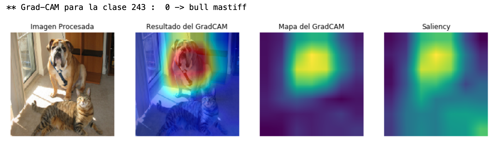

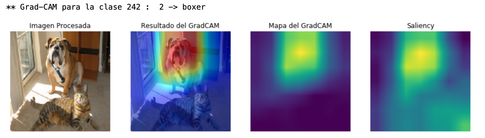
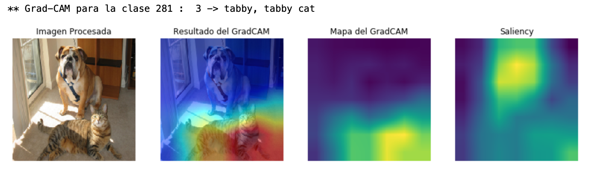
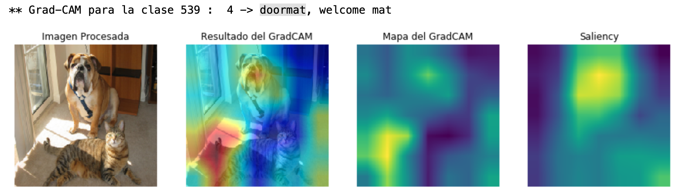

Para otras imágenes también se obtuvierón los siguientes resultados:
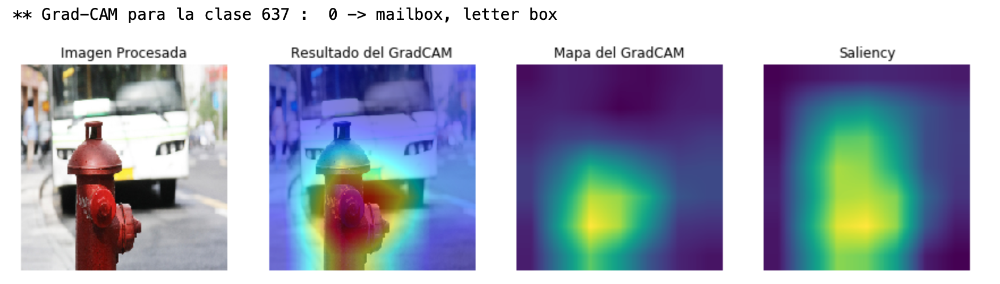
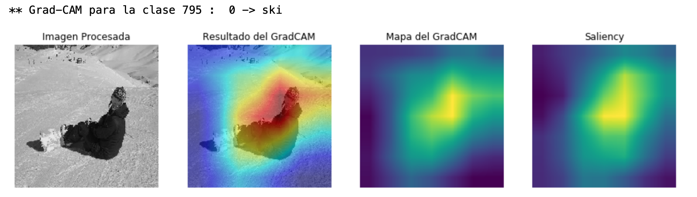
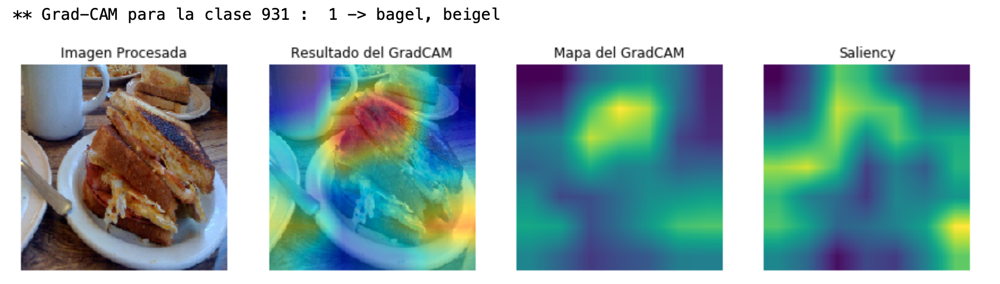
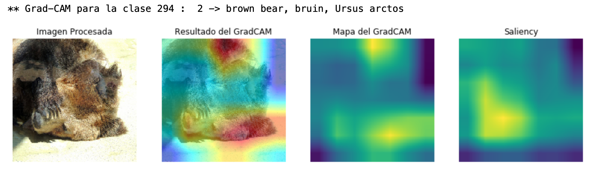
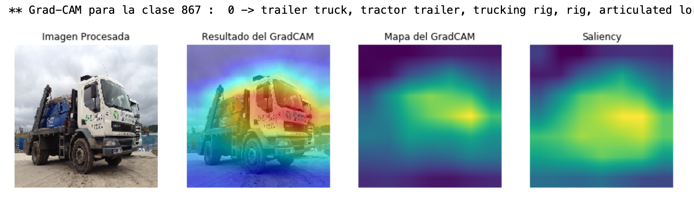
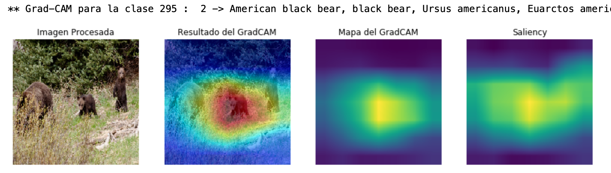
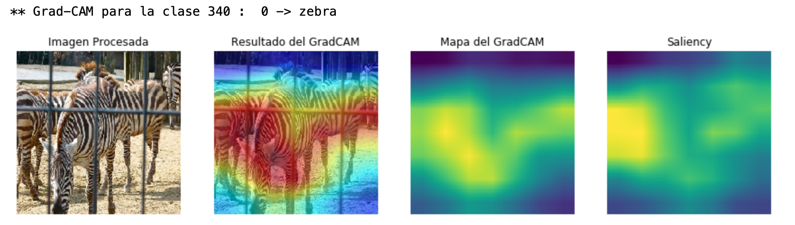
